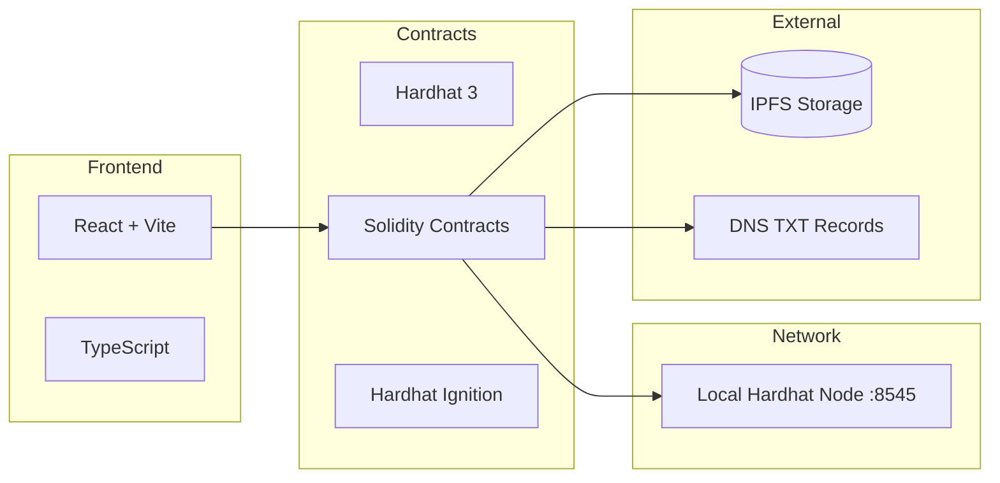
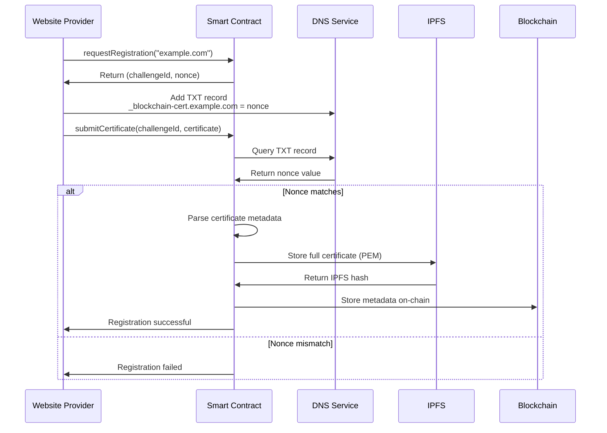
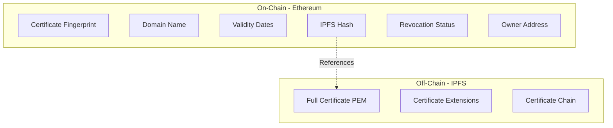
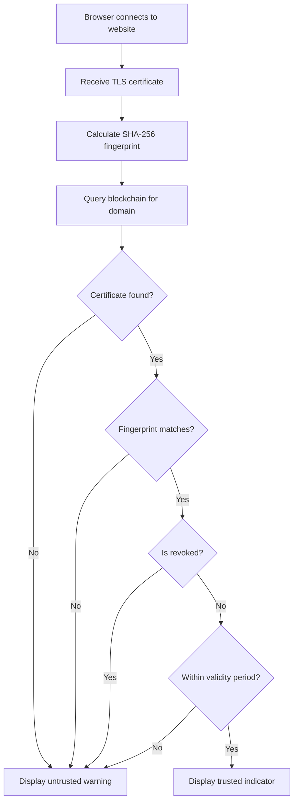

This doc is for storing the mermaid diagrams outside the `ProjectReport.md` file. Why? Becaue the program I use to render the .md file to pdf (Obsidian) renders mermaid diagrams that allows for overflow outside the page limits. Whe approach I went with is to render these mermaids indivisually as svg's (using a tool like [this](https://www.mermaidonline.live/mermaid-to-svg)) and then simply import them into the document. Same output, but without the hastle of trying to design a mermaid diagram that won't overlfow outside some boundries (sometimes impossible)

## System Design

## Registration Flow

## Data Storage Strategy

## Client Validation Flow

